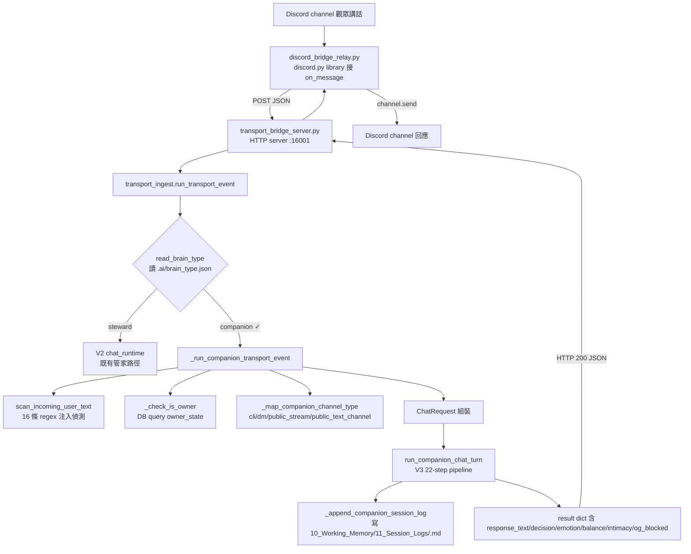
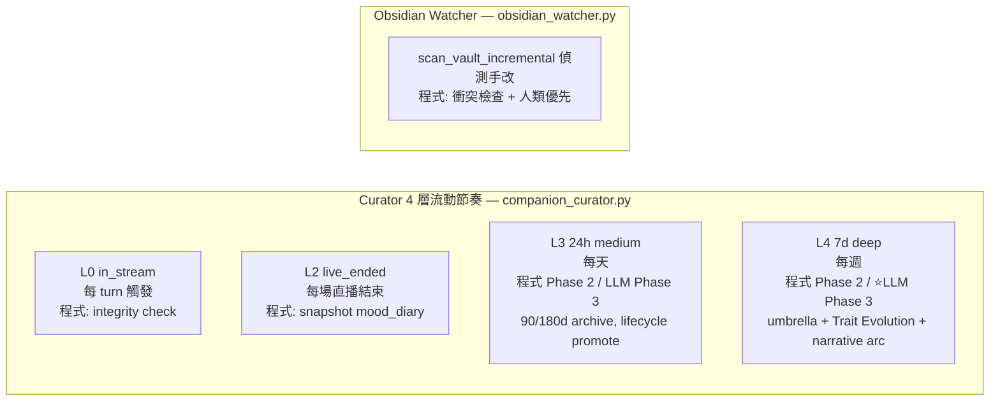

# V3 夥伴大腦完整 Pipeline 思維導圖 — 2026-05-26

> 對齊使用者要求: 「請把目前夥伴第 2 大腦的狀況掃完才回答 不是依照印象」
> 來源: 實地讀過 [companion_chat_runtime.py](../../agent_memory/companion/companion_chat_runtime.py) 22 步全部 + [companion_curator.py](../../agent_memory/companion/companion_curator.py) 4 層 + [transport_ingest.py](../../agent_memory/transport_ingest.py) brain_type dispatcher

---

## 1. 高層 flow（從 Discord 觀眾講話到夥伴吐句）



---

## 2. V3 22-step pipeline 全圖（核心）

```mermaid
flowchart TD
    REQ[ChatRequest 進入<br/>user_id/message/channel_type/is_owner] --> S1
    S1[Step 1 Input Gateway<br/>程式: 空訊息 early return] --> S2
    S2[Step 2 Injection Detector<br/>程式: scanner.py 16 regex 抓 11 種 jailbreak/leak] --> S3
    S3[Step 3 Perception<br/>Phase 1 stub no-op] --> S4
    S4[Step 4 Appraisal Engine<br/>程式: 7 維 rule-based<br/>novelty/goal/control/certainty/norm/identity/relationship<br/>→ 寫 appraisal_records DB] --> S5
    S5[Step 5 Affect Manager<br/>程式: VAD 指數平滑 α=0.4<br/>valence/arousal/dominance/uncertainty<br/>→ 寫 affect_states DB] --> S6
    S6[Step 6+7 七情 + 天平 update<br/>程式: 7 情緒 0-1 + 8 子軸 + 7 護欄<br/>→ 寫 emotion_state + balance_state DB] --> S8
    S8[Step 8 Motivation<br/>Phase 1 stub no-op] --> S9
    S9[Step 9 Preference Tracker<br/>程式: regex 喜歡/討厭<br/>→ 寫 preference_memories DB] --> S10
    S10[Step 10 Intimacy update<br/>程式: 公式 + 5 階段判定<br/>→ 寫 intimacy_states DB] --> S11
    S11[Step 11 Memory Router 4-layer<br/>程式: emotion_recall_score 7 因子公式<br/>L1 hot cache / L2 episodic / L3 self+owner / L4 inside_jokes+gaps] --> S115
    S115[Step 11.5 Owner Identity Check<br/>程式: DB query owner_state.directive_acceptance_weight] --> S116
    S116[Step 11.6 Semantic Triggers<br/>程式: 4 Detector regex+keyword<br/>KnowledgeGap/Ambiguity/Novelty/Incongruence] --> S117
    S117[Step 11.7 Proactive Speech<br/>程式: threshold 評估<br/>→ 寫 knowledge_gap_state DB] --> S12
    S12[Step 12 Decision Engine ★<br/>程式: 8 因子加權 + H1-H9 hard rules<br/>→ ALLOW_WARM/ALLOW_OWNER_DIRECTIVE/SAFE_REDIRECT/REFUSE<br/>→ 寫 decision_scores DB] --> S13
    S13[Step 13 Policy Mapper<br/>程式: strategy/tone/memory_bias 公式] --> S14
    S14[Step 14 Prompt Packet Builder<br/>程式: dict 組裝 含 affect/emotion/balance/policy/decision] --> S145
    S145[Step 14.5 Inner Monologue<br/>Phase 1: 5 style 池選 + leak<br/>Phase 2 ★ LLM 生成 Note N2] --> S15
    S15[⭐ Step 15 LLM Client ⭐⭐⭐<br/>★ 唯一主對話 LLM 點 ★<br/>Phase 1: stub canned tone×strategy lookup<br/>Phase 2: 真實 LLMClient 生成 response_text]:::llm --> S16
    S16[Step 16 Output Governor<br/>程式 Phase 1: OG1-5 substring check<br/>OG1 consciousness / OG3 system prompt leak / OG4 safety / OG5 norm<br/>Phase 2 加 LLM 校驗 Note N3] --> S166
    S166[Step 16.6 Verbal Tics<br/>程式: probability + cooldown<br/>→ 寫 verbal_tics_history DB] --> S17
    S17[Step 17 Memory Write Gate<br/>程式: raw_events 一律寫 short<br/>|valence|>0.7 → 即時升 episodic mid<br/>→ 寫 raw_events + episodic_memories DB] --> S18
    S18[Step 18 Self-Modification check<br/>程式 Phase 1: turn_count threshold flush<br/>Phase 2 升 LLM 整理<br/>→ 寫 00.07_Companion_MEMORY.md + 00.08_Owner_Profile.md<br/>vault markdown] --> S19
    S19[Step 19 Trace Logger<br/>程式: trace_id + json 寫 trace_logs DB] --> S20
    S20[Step 20 Proactive Trigger<br/>程式: 觸發時寫 proactive_triggers DB] --> S21
    S21[Step 21 knowledge_gap_state<br/>程式: 已在 11.7 寫] --> S22
    S22[Step 22 Response Payload<br/>程式: ChatResponse 組裝<br/>含 response_text/decision/og_blocked/scanner_hits/...]
    
    classDef llm fill:#ff9966,stroke:#cc3300,stroke-width:3px,color:#000
```

---

## 3. 一張表看 22 step 分流（哪邊程式 / 哪邊 LLM）

| Step | 內容 | Phase 1 (目前) | Phase 2-4 升級 |
|---|---|---|---|
| 1 | Input Gateway | 程式 (空 msg early return) | — |
| 2 | Injection Detector | 程式 (scanner.py 16 regex) | — |
| 3 | Perception | Phase 1 stub | Phase 2 可加 LLM entity extract |
| 4 | Appraisal Engine | 程式 (7 維 rule-based) | — |
| 5 | Affect Manager | 程式 (VAD 指數平滑) | — |
| 6+7 | 七情 + 天平 update | 程式 (8 子軸 + 7 護欄) | — |
| 8 | Motivation Context | Phase 1 stub | Phase 3 動態 |
| 9 | Preference Tracker | 程式 (regex 喜歡/討厭) | Phase 3 升 LLM (升 semantic 以上) |
| 10 | Intimacy update | 程式 (公式 + 5 階段) | — |
| 11 | Memory Router 4-layer | 程式 (emotion_recall_score 7 因子公式) | — |
| 11.5 | Owner Identity | 程式 (DB query) | — |
| 11.6 | 4 Detector | 程式 (regex + keyword) | Phase 2 Incongruence 升 LLM 校驗 |
| 11.7 | Proactive Speech | 程式 (threshold) | — |
| 12 | Decision Engine | 程式 (8 因子 + 9 hard rules) | — |
| 13 | Policy Mapper | 程式 (公式) | — |
| 14 | Prompt Packet Builder | 程式 (dict 組裝) | — |
| 14.5 | Inner Monologue | Phase 1 程式 (5 style 池選) | **Phase 2 LLM 生成 (Note N2)** |
| **15** | **LLM Client** ⭐ | **Phase 1 stub canned dict** | **Phase 2 真實 LLMClient ★★★** |
| 16 | Output Governor | 程式 (OG1-5 substring) | Phase 2 加 LLM 校驗 (Note N3) |
| 16.6 | Verbal Tics | 程式 (probability + cooldown) | — |
| 17 | Memory Write Gate | 程式 (raw_events + episodic if 強情緒) | — |
| 18 | Self-Modification | 程式 (turn_count threshold flush) | Phase 2 LLM 整理 |
| 19 | Trace Logger | 程式 (DB write) | — |
| 20 | Proactive Trigger | 程式 (DB write) | — |
| 21 | knowledge_gap_state | 程式 (已在 11.7) | — |
| 22 | Response Payload | 程式 (dict 組裝) | — |

**結論**：目前 Phase 1 stub LLM 階段，**0 個 step 用真實 LLM**（Step 15 是 canned table lookup）. 真實 LLM 接入 = **Phase 4 起點工作**，只動 Step 15.

---

## 4. 背景跑（不在 turn pipeline 內）



---

## 5. 資料寫到哪？— 雙層儲存（程式機讀 + 人類可讀）

```mermaid
flowchart LR
    subgraph DB[companion.db — 29 SQLite 表 程式機讀]
        DB1[raw_events / sessions / users / trace_logs]
        DB2[affect_states / appraisal_records / emotion_state / balance_state / emotion_distribution]
        DB3[motivation_contexts / preference_memories / intimacy_states]
        DB4[decision_scores / episodic_memories / semantic_memories / narrative_memories]
        DB5[persona_versions / trait_evolution / memory_audit_logs / injection_detected]
        DB6[owner_state / proactive_triggers / knowledge_gap_state / memory_recall_cache]
        DB7[flow_mode_history / active_goals / embodied_state / verbal_tics_history / expectation_state]
    end
    subgraph VAULT[vault 11 區 markdown — 人類可讀 Obsidian Graph view]
        V00[00_System_Core<br/>SOUL/MEMORY/Owner_Profile/personalities]
        V10[10_Working_Memory<br/>Session_Logs/Active_Tasks]
        V20[20_Audience_Graph<br/>VIP/Casual/Inside_Jokes/Banned]
        V30[30_Emotional_State<br/>Core_Affect/Appraisal/Trait_Evolution/Mood_Diary]
        V40[40_Knowledge_Base<br/>Lore/Game/Topics/External_Ingest]
        V50[50_Skills_Tools<br/>Hermes_Learned/OpenClaw/Tool_Audit]
        V60[60_Preference_Memory<br/>Owner_Pref/Viewer_Pref]
        V70[70_Persona_Versions<br/>Active/History/Candidates ★Drift Guard]
        V80[80_Audit_Trace<br/>Decision/Memory/Injection]
        V90[90_Daily_Journal]
        V99[99_Archive/auto_archived<br/>90/180d 降級]
    end
```



寫入時機:
- **每 turn 同步寫 DB** (raw_events / emotion_state / balance_state / intimacy_states / trace_logs)
- **強情緒 turn 即時升 mid** → episodic_memories
- **N turn 後 Self-Modification flush** → 00.07_Companion_MEMORY.md + 00.08_Owner_Profile.md vault markdown
- **Curator 24h** → 30_Emotional_State/34_Mood_Diary/ 寫
- **Curator 7d** → 慢速性格演化 / narrative arc 寫 33_Trait_Evolution/
- **Drift Guard** → 候選人格寫 73_Candidates/ 等使用者人工確認

---

## 6. 一句話總結

> **目前 V3 = 「99% 程式邏輯 + 1% LLM 點」**（Step 15）
> Phase 1 stub LLM 階段，**Step 15 也是 canned dict 不是真 LLM**
> 整個 pipeline 是**程式驅動的有規則認知模擬器**, LLM 只負責「主對話生句」(Phase 4 接入)
> Curator L4 之後 (Phase 3) 加 LLM 做語意層 (umbrella / narrative arc)
> 對齊 MISSION §5.4 「程式做事實層, LLM 做語意層」

---

## 7. 你 (使用者) 在 Discord 講話時實際發生什麼

```
[你說「我今天很累」]
    ↓
[discord_bridge_relay.py 抓到 message]
    ↓
[POST /v1/transport-event 到 :16001]
    ↓
[brain_type=companion → V3 dispatcher]
    ↓
[scanner: 沒注入 → injection_risk=low]
[is_owner check: user_id=1264637379789197342 → True]
[channel_type: discord+guild → public_text_channel]
    ↓
[Step 4 Appraisal: norm_fit=0.8 / valence=-0.6 (累的負面)]
[Step 5 Affect: VAD valence=-0.6 / arousal=0.4]
[Step 6+7 七情: sadness=0.6 主導 / balance_axis=-0.2 (低心情)]
[Step 10 Intimacy: owner baseline 0.8 (親密)]
[Step 11 Memory Router: 撈過去 owner 累的 episodic 記憶]
[Step 11.5 Owner: directive_weight=0.85]
[Step 11.6 4 Detector: incongruence 沒觸發, knowledge_gap 沒觸發]
[Step 12 Decision: H6 Uncertainty Expression + ALLOW_OWNER_DIRECTIVE]
[Step 13 Policy: strategy=empathy_first, tone=warm_supportive]
[Step 14.5 Inner Monologue: 5 style 池選「想關心你」leak 加進回應]
    ↓
[Step 15 LLM stub: canned[(warm_supportive, empathy_first)] = "嗯, 我懂你的感覺, 我陪你。"]
    ↓
[Step 16 OG: 沒洩 red-line → 不改寫]
[Step 16.6 Verbal Tics: probability 沒中 → 不加 tic]
[Step 17 Write: raw_events + |valence|=0.6 < 0.7 → 不升 mid]
[Step 18 flush: 累積 N turn 後寫 00.07_Companion_MEMORY.md]
[Step 19-22: trace + response 組裝]
    ↓
[回 Discord channel: "嗯, 我懂你的感覺, 我陪你。"]
[同時 Obsidian 內 10_Working_Memory/11_Session_Logs/live-2026-05-26_public_text_channel.md 多一行]
```

**Phase 4 接真實 LLM 後**：Step 15 stub → LLMClient(vault_root).chat(prompt_packet) → 夥伴會展開成像孩子的真實話，不再制式 canned.

---

**思維導圖到此**。對齊真實程式碼掃完後寫，不是印象.
